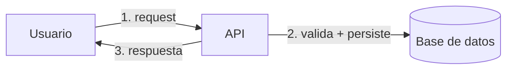
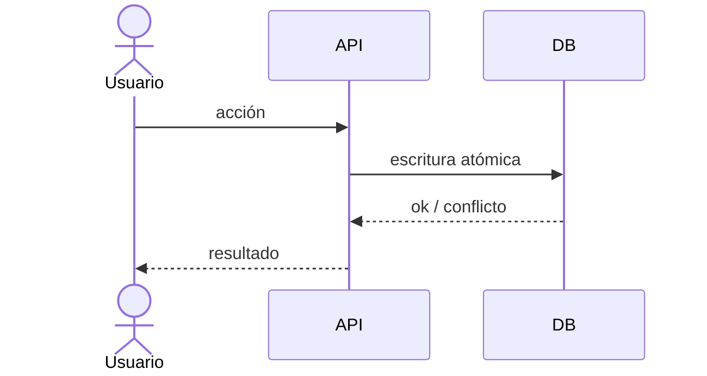
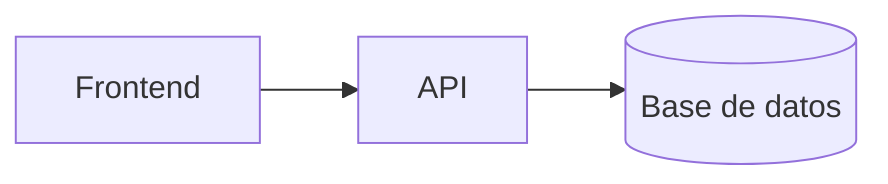

# Arquitectura — mapa vivo del sistema (EJEMPLO)

> Documento único y vivo: cada sección se REEMPLAZA cuando cambia, nunca se apila. Mantiene el nivel alto a
> propósito (diagrama Mermaid corto + 2-3 líneas). El "por qué" de cada decisión vive en `docs/adr/README.md`
> — este documento es el mapa, no la justificación. Lo mantiene `architect` cada vez que una decisión cambia
> el flujo de datos, un workflow, un caso de uso, o el mapa de componentes.

## Flujo de datos
<Cómo entra y viaja un dato típico por el sistema, de punta a punta.>

## Workflows clave
<Un `sequenceDiagram` corto por workflow importante — no todos, solo los que un lector nuevo necesita para
entender cómo funciona el sistema por dentro.>

## Casos de uso
<Lista corta de los casos de uso principales. Sumá un diagrama solo si un texto no alcanza.>
- <Caso de uso 1>
- <Caso de uso 2>

## Mapa de componentes
<Qué módulos/servicios existen y cómo se hablan — sin detalle interno de cada uno.>

## Decisiones
<Tabla que solo linkea a `docs/adr/README.md` — el ADR es la fuente de verdad, esto es el índice de acceso
rápido a las decisiones que dieron forma al mapa de arriba.>

| Área | ADR |
|---|---|
| <ej. Persistencia> | [ADR-0001](../adr/0001-ejemplo.md) |
