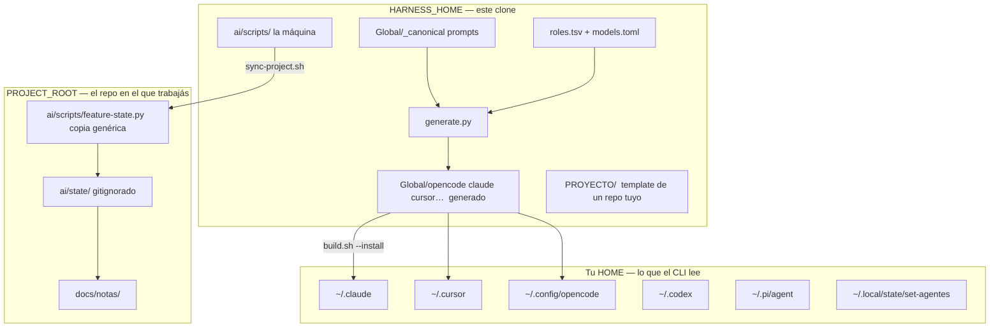
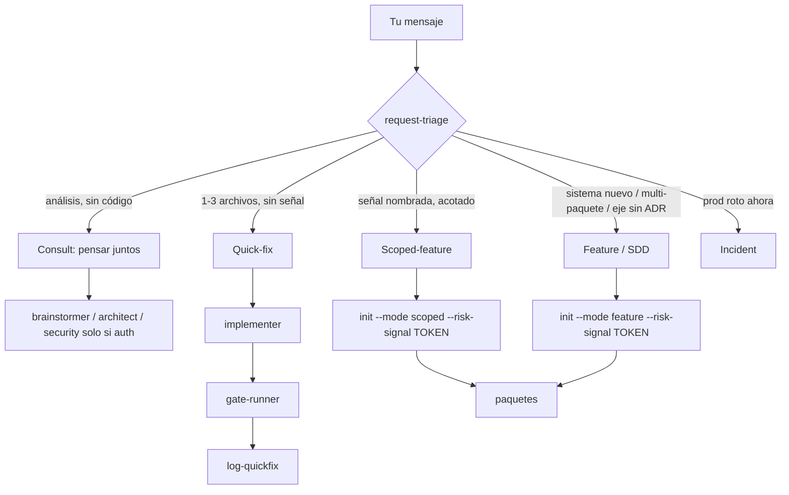

# Cómo funciona SET-AGENTES (de punta a punta)

Documento educativo, escrito el 2026-08-20. No es un ADR ni un spec: es el mapa para
entender **qué es este harness, cómo se mueve un pedido tuyo, y por qué a veces no ves
un review de seguridad ni uno de infraestructura**.

Cada afirmación dura cita un archivo del repo. Si el código cambió y esta página no,
gana el código.

Lecturas hermanas (más técnicas, menos pedagógicas):

- [`README.md`](../README.md) — la promesa y la instalación
- [`TIPS-USO.md`](../TIPS-USO.md) — control plane y drift
- [`docs/architecture/overview.md`](architecture/overview.md) — mapa del ruteo
- [`docs/modules/`](modules/) — un módulo cognitivo por pieza (`estado`, `routing`, `consola`, …)
- [`docs/adr/README.md`](adr/README.md) — las decisiones formales
- [`docs/notas/00 - Proyecto.md`](notas/00%20-%20Proyecto.md) — el vault vivo (Obsidian)

---

## 1. En una frase

SET-AGENTES **no es un chatbot con muchos prompts**. Es un **compilador de proceso**:

1. Un roster canónico de 28 roles (`roles.tsv` + `Global/_canonical/`).
2. Un generador que los proyecta a cinco CLIs distintos (`generate.py` → `Global/{opencode,claude-code,codex,pi,cursor}/`).
3. Un instalador con backup y rollback (`install.py` → `~/.claude`, `~/.cursor`, …).
4. Una máquina de estados **en archivos** (`feature-state.py`) que no deja que el que escribió el código se apruebe a sí mismo, y que cobra ceremonia solo cuando hay una señal de riesgo **nombrada**.

Claude Code, Cursor, OpenCode, Codex y pi siguen siendo quien escribe. El harness es el
proceso **alrededor**: quién puede mutar, quién revisa, qué gate tiene que mirar de
verdad, y dónde queda la evidencia cuando se corta la sesión.

---

## 2. Las tres capas físicas (si mezclás estas, todo se siente mágico)



| Capa | Qué es | Confianza |
|---|---|---|
| **Harness** | El clone de SET-AGENTES | Tuyo, trusted |
| **Install** | Copia gestionada en `$HOME` | Tiene que coincidir con el repo (`check-drift.sh`) |
| **Proyecto** | `shopify-sync`, este mismo repo, el que sea | Untrusted de cara al harness: el context pack se marca, el vault viaja por `--context` |

Eso es [ADR-0008](adr/0008-two-roots-portability.md). El harness se resuelve **una vez**
en install. El proyecto se descubre **por `cwd`** en cada invocación.

Tres “drifts” distintos (no son el mismo bug):

| Comando | Compara |
|---|---|
| `./build.sh --check` | `Global/` regenerado vs `Global/` trackeado, y `PROYECTO/ai/scripts` vs `ai/scripts` |
| `ai/scripts/check-drift.sh` | lo instalado en `$HOME` vs este repo |
| `ai/scripts/sync-project.sh <dir>` | scripts genéricos del template vs un proyecto guest |

Si ves `DRIFT_DETECTED` después de un commit, no es un test rojo: es “el CLI que estás
usando todavía tiene la generación anterior”. En julio 2026 eso dejó revisores caros
huérfanos y un MCP prendido. Por eso el post-commit hook avisa.

---

## 3. Un pedido tuyo, en cinco lanes (no en un solo pipeline)

El orquestador **no arranca SDD por default**. Primero clasifica. Eso vive en el skill
`request-triage` y se **enforcea** en el CLI desde [ADR-0064](adr/0064-ruteo-organico-enforceable.md).



Los tokens de riesgo son una lista **cerrada**
(`ai/scripts/feature_state_lib/model.py:139-147`):

`money-billing` · `data-migration` · `auth-pii` · `public-contract` · `multi-module` · `user-asked-full-pipeline`

`init --mode scoped` o `feature` **sin** `--risk-signal` muere con `RISK_SIGNAL_REQUIRED`
y **no deja JSON** (`cli_lifecycle.py:154-157`). El default del flag `--mode` sigue
siendo `scoped` a propósito: un `init` pelado falla cerrado en vez de abrir ceremonia
en silencio.

Presupuestos físicos (`MODE_BUDGETS`, `model.py:123-128`):

| Lane | `init` | Spawns/paquete | Ciclos de review | Fallos de gate |
|---|---|---|---|---|
| Feature | sí + señal | 12 | 2 | 3 |
| Scoped | sí + señal | 8 | 2 | 3 |
| Quick-fix | **no** | 4 | 1 | 2 |
| Incident | sí (sin señal) | 6 | 1 | 2 |

**Quick-fix es la lane del día a día.** Un arreglo de 1–3 archivos sin señal de riesgo
no crea feature, no crea paquete, no llama a `security-auditor`, no llama a `architect`,
no levanta la app. Hace: implementar → gate → `log-quickfix`. Eso no es un agujero: es
el diseño de 033+034, para que un login no vuelva a costar 4–5 horas de panel.

Si **querés** el panel completo en un cambio chico, el token existe:
`--risk-signal user-asked-full-pipeline`.

---

## 4. Por qué en Claude no ves security ni “infra” (esto no está roto)

Lo medí contra el código, no contra la sensación de la sesión.

### 4.1 No es Claude. Es la lane

`security-auditor`, `architect`, `app-runner` y `runtime-verifier` **no se auto-disparan**.
Ningún hook los invoca. Solo corren si el orquestador los spawnea **y** registra
`record-spawn`.

En Claude Code sí hay hooks (`Global/claude-code/hooks/coord_policy.py`): deny-by-default
de bash, allowlist de `feature-state.py` y de `--route-decide`. Eso **no** spawnea
revisores. Cursor, al revés, **no instala hooks** — la superficie es el permiso nativo
de Cursor.

Usar Claude como día a día no apaga el panel. Usar **quick-fix** sí.

Evidencia reciente:

| Feature | ¿Corrió `security-auditor`? |
|---|---|
| 033 (seis paquetes, en Cursor) | Sí, en los seis. Incluso PKG-6, donde el CLI **no lo exigía** (`small+low`) y el orquestador lo mandó igual |
| 034 PKG-A | **No**. El plan lo declaró `complexity=small`, `risk=low` → panel de un solo `package-reviewer` |
| 034 PKG-B, C, D | Sí |

Si tus sesiones de Claude son “arreglá esto / pulí aquello / un archivo”, el orquestador
está haciendo lo que 034 le pidió: **no abrir ceremonia**.

### 4.2 Cuándo el CLI **sí** obliga a security-auditor

Hay tres capas, y no coinciden del todo:

**Prosa** (skill `request-triage`): auth / money / PII / input externo →
`security-auditor` es mandatory antes del juez.

**CLI del panel** (`required_reviewers_for`, `model.py:565-575`):

- `complexity=small` **y** `risk=low` → solo `package-reviewer`
- cualquier otro caso (complexity unset cuenta como medium) → `package-reviewer` + `security-auditor`

Eso se enforcea en `start-review-panel` (`feature-state.py:569-587`): si falta un rol
requerido, el comando muere. Si el paquete es `small+low` y metés de más, también muere.

**Hueco real:** `record-review` (el verbo “legacy” de un solo reviewer) **no** consulta
`required_reviewers` (`cli_review.py:21-60`). Un coordinador puede cerrar review con un
solo `package-reviewer` aunque el paquete pida el panel completo. `accept-package` solo
pide que exista un review con `verdict=pass`, no que hayan corrido todos los roles
declarados. Eso es un gap de enforcement, no de doctrina.

`classify-risk.py` es **evidencia**: imprime un nivel según paths/contenido. **No escribe**
`risk` en el paquete. Un `RISK_LEVEL=high` por un shebang no obliga a nadie.

### 4.3 No existe un rol “infrastructure-auditor”

Cero referencias en el repo. Lo que la gente llama “gate de infra” está partido:

| Pregunta | Quién la cubre | Cuándo |
|---|---|---|
| ¿Postgres o vector? ¿API Gateway? ¿Vercel o VPS? | `architect` + `spec-challenger` | **Antes** de aprobar el spec, o si un quick-fix toca un eje sin ADR |
| ¿La app levantada se comporta? | `app-runner` + `runtime-verifier` | Solo si el planner puso `runtime_surface=true` |
| ¿El paquete no tiene UI/servidor? | waiver físico en `record-testing` | `create-package --runtime-surface false` → `runtime_qa` pass automático (`cli_repair.py:375-386`) |
| ¿N+1, transacciones, paginado? | checklist de `package-reviewer` ([ADR-0021](adr/0021-readability-resilience-checklists.md)) | En el review de paquete, no un agente extra |

Por eso 034 PKG-D (pines de Cursor, sin app) no instanció `runtime-verifier`: el paquete
declaró que no había superficie runtime, y el CLI waivió. Correcto.

### 4.4 Claude vs Cursor vs OpenCode (lo que sí cambia el runtime)

| | Claude Code | Cursor | OpenCode |
|---|---|---|---|
| ¿Puede orquestar? | Sí (tiene el roster completo) | Sí (host desde 032) | Sí (lane con hooks generados) |
| `--route-decide` | Permitido | **Prohibido** (Cursor no es lane de routing, [ADR-0063](adr/0063-cursor-pins-por-rol.md)) | Permitido |
| Hooks `coord_policy` | Sí | No | Sí (árbol generado) |
| Modelo del escritor | ruteo / alias `sonnet` | pin `composer-2.5` | `opencode/deepseek-v4-flash-free` |
| Independencia reviewer | otro proveedor vía router | **otro pin de familia** (`gpt-5.6-sol`); `inherit` en reviewer muere en `generate.py` | otro proveedor vía router |

`TIPS-USO.md` ya refleja que OpenCode, Claude Code y Cursor pueden orquestar (spec
035 PKG-C). Lo que no cambia es la lane: si no hay `init` con señal de riesgo, no hay
panel (invariante 2, ADR-0064).

---

## 5. El pipeline de un paquete (cuando sí hay ceremonia)

Post-aprobación tuya (`USER_APPROVAL`):

```
PACKAGE_PLANNING
  → PACKAGE_IMPLEMENTATION
  → PACKAGE_GATES
  → PACKAGE_REVIEW          (panel, no un self-check)
  → PACKAGE_REPAIR          (si hace falta; un ciclo consolidado)
  → DELTA_REVIEW            (solo el arreglo)
  → PACKAGE_TESTING
  → PACKAGE_RUNTIME_QA      (o waiver)
  → PACKAGE_ACCEPTED
  → INTEGRATION             (los paquetes juntos vs el spec)
  → DONE | BLOCKED
```

Fases y transiciones legales: `model.py:18-50`. El orquestador **no salta fases** con un
prompt: `feature-state.py transition` rechaza lo ilegal.

Quién hace qué:

| Fase | Rol | Qué produce |
|---|---|---|
| Spec | `product-analyst` | Feature Contract (spec + no-goals + ACs) |
| Diseño | `architect` | ADRs si hay decisión nueva; chequea tres ejes |
| Desafío | `spec-challenger` | Hallazgos **antes** de que apruebes; un finding de arquitectura bloquea `USER_APPROVAL` |
| Plan | `package-planner` | paquetes con `owned_paths`, `complexity`, `risk`, `runtime_surface`, `required_reviewers` |
| Código | `implementer` / `frontend-engineer` / … | diff + evidencia RED/GREEN local |
| Gate | `gate-runner` o `local-gate-runner` (P001) | `record-gate` con comando que **miró** algo |
| Review | `package-reviewer` ± `security-auditor` | findings con id, severidad, evidencia, reparación mínima |
| ¿El finding es real? | `finding-verifier` | único actor que puede **refutar** (`REFUTING_ACTORS`) |
| Repair | `repair-agent` | no se aprueba a sí mismo (`NON_ACCEPTING_ACTORS`) |
| Delta | `delta-reviewer` | solo el diff del repair |
| Integración | `integrator` | `INTEGRATION.md` + verify global |
| Juez | `adversarial-judge` | ¿el spec se cubrió de verdad? |
| Memoria | `memory-scribe` | `docs/ai/knowledge/`, **no** Engram |

El que escribe no acepta el paquete. Eso no es un slogan: `NON_ACCEPTING_ACTORS` está
en `model.py:90`.

Dos techos más, aparte de los spawns ([ADR-0061](adr/0061-techo-frontier-aparte-de-spawns.md),
[ADR-0062](adr/0062-salvage-unico-convive-con-0023.md)):

- **Frontier:** 4 modelos pesados por paquete, 16 por feature. Distinto del contador de spawns.
- **Salvage:** un único intento pesado si el escritor barato falló el gate. El segundo es
  decisión tuya, no otro spawn automático.
- P001 (`local-gate-runner`) **no cuenta** como frontier: un unittest no se disfraza de
  modelo caro.

---

## 6. Los 28 roles, sin magia

Fuente: `roles.tsv` (una fila por rol). Los prompts viven en `Global/_canonical/agents/`.
`generate.py` emite el frontmatter nativo de cada CLI.

| Duty | Capability | Roles | Pueden escribir código |
|---|---|---|---|
| `coord` | `coord-ro` | orchestrator | no |
| `docs` | `docs-rw` | product-analyst, architect, package-planner, … | no (docs/ADRs) |
| `implement` | `code-rw` | implementer, repair-agent, debugger, frontend-engineer, refactor-specialist, integrator, test-writer | **sí** |
| `gate` | `gate-ro` | gate-runner, local-gate-runner | no |
| `audit` | `review-ro` | spec-challenger, package-reviewer, delta-reviewer, security-auditor, finding-verifier | no |
| `judge` | `review-ro` | adversarial-judge | no |
| `ops` | `run-ro` | app-runner, runtime-verifier | no |
| `memory` / `release` | … | memory-scribe, github-release-manager | no |

Read-only no es un comentario en el prompt: en Cursor es `readonly: true` en el
frontmatter; en Claude/OpenCode es sandbox + `coord_policy`. Un reviewer que “de paso
arregla” está violando el harness.

Hay 42 skills y 23 slash commands, todos generados desde `_canonical`. No los edités
en `~/.claude` ni en `Global/claude-code/`: se pisan en el próximo `build.sh --install`.
Editá el canónico y regenerá.

---

## 7. Gates deterministas vs revisores (dos familias)

Los **gates** son scripts. No opinan. O el árbol coincide, o no.

| Gate | Mira | ¿Es un audit OWASP? |
|---|---|---|
| `ai/scripts/verify.sh` | `build.sh --check`, unittest, `py_compile`, `git diff --check`, paridad `Global/` | No. Sync + tests |
| `./build.sh --check` | template vs harness, generación vs `Global/` | No |
| `check-drift.sh` | install vs repo | No |
| `check-owned-paths.py` | el diff del paquete vs `owned_paths` (incluye untracked, [ADR-0051](adr/0051-owned-paths-sees-untracked-files-and-test-isolation.md)) | No. Aislamiento de alcance |
| `check-repair-ceiling.py` | techo de líneas del repair ([ADR-0023](adr/0023-bounded-repair-ceiling.md)) | No. Presupuesto |
| `classify-risk.py` | paths/contenido del candidato | Advisory |
| `release_gate.py` | verify + judge + cobertura de auditores por superficie `auth`/`money`/`pii` | **Sí**, en el camino de release |

Los **revisores** son agentes. Opinan con evidencia. `security-auditor` hace red-team +
hardening en **un** pase (no hay un agente “blue team” separado). `package-reviewer`
cubre corrección, arquitectura del diff, tests, datos y escala.

Un `VERIFY_PASS` **no** sustituye a `security-auditor`. Un `security-auditor` **no**
sustituye a `verify.sh`. Si en Claude solo ves el unittest, viste la primera familia.

---

## 8. Modelos y cuota (por qué el escritor es barato)

`models.toml` es la fuente de verdad ([ADR-0003](adr/0003-models-toml-source-of-truth.md)).
Las suscripciones de **esta máquina** viven en overlay
(`~/.local/state/set-agentes/subscriptions.local.toml`), no en git.

Desde 034:

- Quien escribe código arranca en **barato/free con tools**, no en `-fast`
  ([ADR-0060](adr/0060-code-rw-default-barato-no-fast.md)). OpenCode:
  `opencode/deepseek-v4-flash-free`. Cursor: `composer-2.5`.
- Quien juzga / audita usa **otra familia**. En Cursor, `inherit` en un reviewer es un
  bug: `inherit` es el modelo del padre, no una segunda familia. `generate.py` lo
  rechaza.
- OpenCode/Claude/Codex/Pi rutean por spawn (`--route-decide`, [ADR-0030](adr/0030-decide-always-materialize-per-lane.md)).
  Cursor **nunca** rutea: el pin está en el frontmatter.
- Independencia de reviewer en las lanes con router: si writer y reviewer caen en el
  mismo proveedor, el router niega con `REVIEWER_INDEPENDENCE_UNAVAILABLE`. No se
  saltea con un prompt.

Engram quedó **fuera** a propósito (034): el contexto durable es el vault Obsidian
(`docs/notas/`) más `feature-state.py`. El MCP de Engram existe en el catálogo y arranca
**disabled**.

---

## 9. Dónde vive la verdad (file-first)

El chat es coordinación. Si la sesión muere, esto tiene que bastar para retomar:

| Artefacto | Qué es |
|---|---|
| `ai/state/features/<id>.json` | máquina compacta (gitignorado, se siembra de `ai/state.seed/`) |
| `ai/state/STATUS.md` | tablero técnico, regenerado |
| `docs/specs/<id>/` | spec, plan, tasks, acceptance, evidence, bitácora |
| `docs/notas/` | vault humano; bloques entre `<!-- notas:auto -->` los pisa la máquina |
| `docs/adr/` | decisiones que sobreviven al paquete |
| `docs/ai/knowledge/` | lo que `memory-scribe` consolidó |
| `log-decision` / `log-quickfix` / `log-narrative` | el hilo, no el transcript |

[ADR-0040](adr/0040-honest-digest-shared-liveness-predicate.md): una feature `BLOCKED`
**sigue viva** en el digest. No desaparece porque molesta. `feature_is_live()` es
`final_state != "DONE"`, igualdad exacta.

[ADR-0026](adr/0026-evidence-over-memory.md): ninguna afirmación técnica sin fuente
(`file:line`, salida de un comando corrido, URL actual). La memoria del modelo sobre
precios, APIs y versiones **no es fuente**. Si no hay, se escribe “sin verificar”.

---

## 10. Qué te distingue del resto

No es “tenemos más agentes”. Gentle-AI también tiene muchos. La diferencia está en
**qué está en código y qué es un prompt**.

| Invariante | Acá | Kit genérico / Gentle |
|---|---|---|
| El que escribe no aprueba | `NON_ACCEPTING_ACTORS` + reviewer `readonly` + (en lanes con router) exclusión de proveedor | El mismo modelo se revisa |
| Ceremonia con señal nombrada | `RISK_SIGNAL_REQUIRED` en el CLI | SDD siempre, o nunca |
| Writer barato, juez caro | áreas en `models.toml` + techo frontier | Un modelo “el mejor” para todo |
| Gates que miran | `verify.sh` compara `Global/` de verdad ([ADR-0041](adr/0041-build-check-verifies-global.md)); `owned_paths` ve untracked | Tests que pasan con el código roto |
| Command policy | deny-by-default, argv enumerado ([ADR-0059](adr/0059-prefix-match-rce-fix.md)) — un prefix match era RCE desde el rol read-only | Allowlist laxa o inexistente |
| Estado en el repo | JSON + notas + ADRs | El hilo de chat |
| Tablero honesto | `BLOCKED` no se esconde | Digest que solo muestra lo verde |
| Cinco CLIs, un roster | `generate.py` | Un `AGENTS.md` copiado a mano |
| Cursor con pines por rol | `inherit` en reviewer es inválido | `model: inherit` en todos |
| Vault, no Engram | Obsidian + `docs/notas/` | Memoria vectorial opcional |
| Reparación acotada | techo de líneas + un salvage + dos ciclos de review | Loop infinito de “arreglo y rompo” |
| Preguntar menos | [ADR-0037](adr/0037-resolve-before-asking-protocol.md): pedido → notas → decisions-log → spec, en ese orden | El agente te pregunta lo que ya decidiste |

La analogía útil: un CLI de IA suelto es un cirujano talentoso operando sin
instrumentista, sin hoja de anestesia y sin que nadie cuente las gasas. El harness
no opera mejor; **hace que la operación deje rastro y que quien cierra no sea quien
abrió**.

El costo es real. Por eso existe quick-fix. El README lo dice: para un script de diez
líneas, el ciclo completo es peso muerto.

---

## 11. Cómo está hecho el código (y por qué no lo “pulí” todo)

Leí el mapa. Un refactor de calidad/comentarios/tiempos **sobre todo el repo** choca
con una regla del propio harness: no hay refactors oportunistas; un refactor necesita
alcance, aceptación y verificación.

Archivos grandes (conteo ~2026-08-20, `wc -l`):

| Archivo | ~Líneas | Por qué está así |
|---|---|---|
| `tests/test_harness.py` | ~15 000 | Es el contrato golden. Partirlo sin ACs pierde mordidas |
| `ai/scripts/set_agents_app.py` | ~4 400 | Consola + routing CLI + vault + scaffold en un módulo |
| `ai/scripts/feature-state.py` | ~1 360 | CLI; parte ya salió a `feature_state_lib/` |
| `ai/scripts/install.py` | ~1 130 | Merge/rollback/uninstall por delta |
| `ai/scripts/generate.py` | ~875 | Cinco harnesses + validadores Cursor |

La duplicación `ai/scripts` ↔ `PROYECTO/ai/scripts` ↔ `Global/*/hooks/feature_state_lib`
**es intencional**: el gate de paridad es lo que impide que el template de un proyecto
guest se atrase. “SECAR” esas copias a mano es exactamente cómo se cuela un twin
viejo.

Los tres cortes de la spec
[`035-panel-honesto-consola-y-tips`](specs/035-panel-honesto-consola-y-tips/spec.md) ya están
entregados (INTEGRATION, 2026-08-21):

1. **PKG-B — Consola partida:** segunda pasada routing/vault con caracterización previa de los
   tres canales (`stdout`/`stderr`/exit); el residuo quedó enumerado en path (b) — matriz
   16/16, ADR-0066, evidencia `PKG-B-residue-matrix.md`.
2. **PKG-A — Panel honesto:** `record-review` ya **no** puede saltear `security-auditor` en
   paquetes medium/high ni registrar `pass` con findings bloqueantes abiertos en small+low —
   ADR-0065, `cli_review.py:31-67`; la puerta legítima del panel FULL es
   `start-review-panel` → `record-subreview` → `finalize-review-panel`.
3. **PKG-C — TIPS al día:** `TIPS-USO.md` y este documento dejaron de contradecirse sobre
   control plane, árboles Global y cobertura de consumo (ver §4.4 arriba y `TIPS-USO.md:7-18`).

Polish **nuevo** más adelante sigue siendo por paquetes scoped con `--risk-signal` explícito —
no un pase libre — pero estos tres no están pendientes ni sin dueño.

---

## 12. Cómo pedirle al harness lo que extrañás

| Lo que querés ver | Qué hacer |
|---|---|
| `security-auditor` en un cambio chico | `--risk-signal auth-pii` (si hay auth/PII de verdad) o `user-asked-full-pipeline`; y que el planner **no** declare `small+low` si el riesgo no es low |
| Review de arquitectura / “infra” | Eso es `architect` **antes** del spec, o un eje abierto (store / gateway / deploy) sin ADR. En un bugfix de UI no va a aparecer |
| `runtime-verifier` | El paquete tiene que tener `runtime_surface=true` (hay una app que se puede levantar) |
| Solo el gate de tests | Quick-fix. Es el default. Está bien |
| Forzar el panel aunque el CLI diga `small+low` | `extend-review-panel --role security-auditor --reason "…"` — 033 PKG-6 hizo eso a mano |

---

## 13. Mapa de lectura (si querés bajar al código)

Empezá por estos, en este orden:

1. `roles.tsv` — quién existe
2. `Global/_canonical/agents/orchestrator.md` — la doctrina (el generate le pega overrides por runtime)
3. `ai/scripts/feature_state_lib/model.py` — presupuestos, fases, paneles
4. `ai/scripts/generate.py` — cómo nacen los cinco árboles
5. `ai/scripts/coord_policy.py` — qué puede ejecutar un rol read-only
6. `models.toml` — quién es barato y quién juzga
7. Un spec cerrado, por ejemplo `docs/specs/034-cuota-organica-y-writer-barato/spec.md` — cómo se ve el proceso cuando se usó de verdad

El dashboard vivo (`ai/state/STATUS.md`) a veces **atraza** el cierre humano: al
2026-08-20, 032 figura en `PACKAGE_GATES` y 033 en `INTEGRATION` aunque el trabajo
ya se usó como base de 034. El predicado honesto es `final_state`; si no es `DONE`,
el digest te lo va a seguir mostrando. Eso también es el harness: no esconde deuda.

---

## 14. Lo que este documento no es

No reemplaza al spec de una feature. No es la fuente de verdad de los pines (eso es
`models.toml`). No te pide que memorices 60 ADRs: si hay que decidir, se lee el ADR
del eje, no esta guía.

Si una sesión de Claude te deja la sensación de “trabajé solo, sin red”, preguntate
primero: **¿había una señal de riesgo nombrada?** Si no, el harness hizo lo que le
enseñaste en 034. Si sí, y igual no spawneó `security-auditor`, ahí sí hay un bug de
orquestación (o se usó `record-review` en vez de `start-review-panel`).
