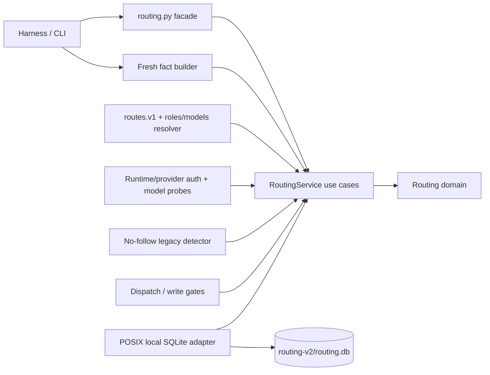
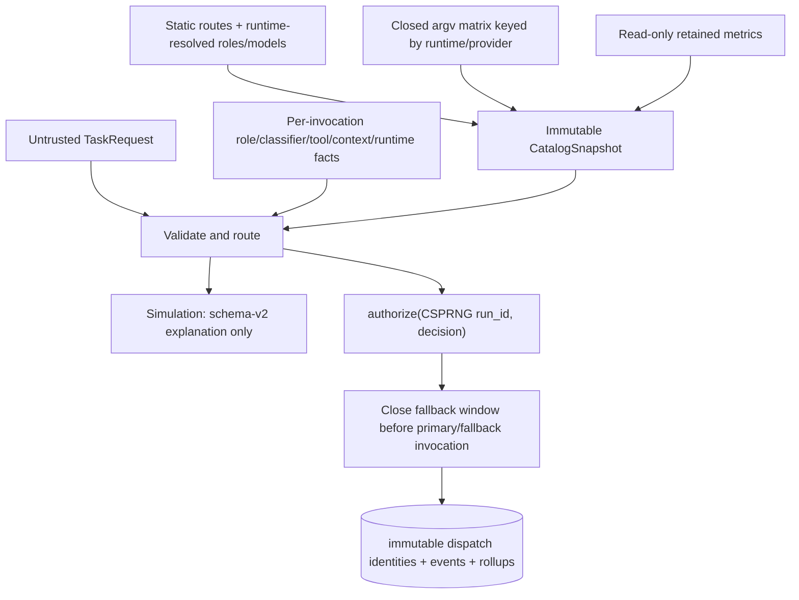
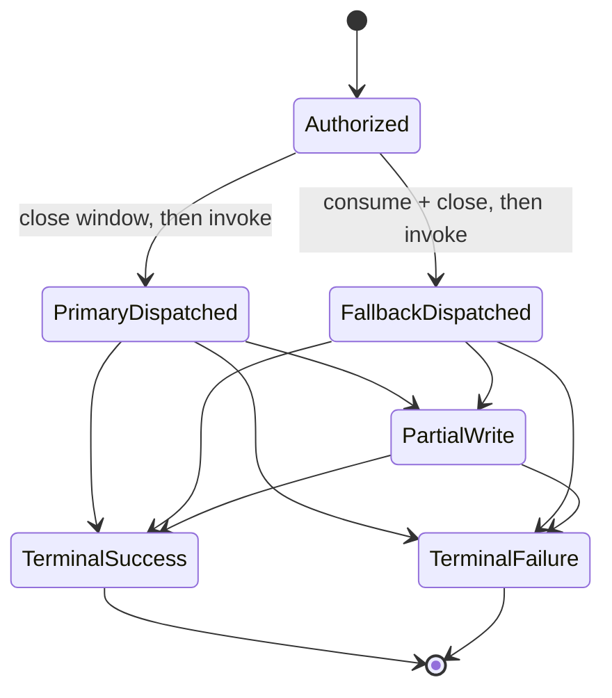
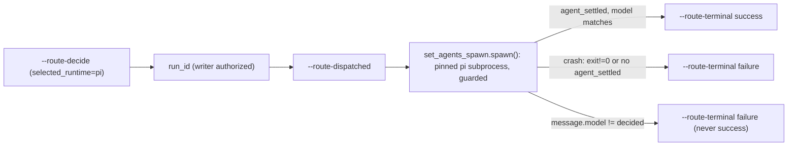

# Architecture overview

This is the current high-level map for trusted routing P1R. It describes the accepted architecture target, not
evidence that implementation is complete; decision rationale lives in the [ADR index](../adr/README.md).

## Component map

Policy and immutable values live in the domain; dependencies point inward. Caller intent cannot supply observed
facts, catalog, auth, IDs, or paths. Production persistence is fixed-root POSIX/local only; simulation is composed
without the SQLite mutation or dispatch capability.

## Data flow

Each static ID binds exactly the catalog tuple without runtime; a runtime-only change preserves `route_id`.
`CatalogSnapshot` separately binds that ID to immutable
`(route_id,runtime,provider,model,family,effort)` compatibility, and any authorization mismatch fails closed. A
truncated-ID collision invalidates the snapshot.
Missing/conflicting `selected_runtime` or any other mandatory fact disables dispatch. Auth cannot cross runtime
boundaries: only the four approved P1R mappings are executable; Pi is simulation-only with execution disabled
until P2/P3. Explain leaves the SQLite dispatch/event state byte-identical and never creates it — but (004
P1, ADR-0006 AM-2) it is no longer "stateless" in the literal sense: it may READ the regenerable
`routing-v2/probe-cache.json` file to answer without paying a full live probe, and composition may even
create/validate that cache's private 0700 root directory so a later real decision can warm it. Explain never
WRITES `probe-cache.json` itself (`cache_write=False` for every non-writer/simulate lane) — reading a cache is
not a mutation; persisting a fresh probe result is. See ADR-0006 for the cache's key, TTL, and negative-result
policy (a failed pair is never cached, so a transient failure costs one retry, never the whole TTL window).

## Key workflows

A pre-dispatch restart may consume fallback only if the durable row is still
authorized/open/non-partial/non-terminal; after `mark_dispatched`, external start, or failed terminal commit it
never may. Reviewer/auditor/judge routing uses the actual provider/model/family/effort/runtime of a
terminal-success `code-rw` dispatch, excludes its family, and prefers another authenticated provider.

## Use cases and delivery boundary

- Explain a trusted hypothetical route without mutating the SQLite dispatch/event state (it may read, never
  write, the probe cache — see above).
- Decide a real task descriptor (004 P1 `--route-decide`): durably authorize a writer, report an independent
  review decision, or report a non-executable decision for any other role class — see the CLI contract below.
- Authorize exactly one writer and at most one pre-write fallback.
- Route independent review from persisted writer identity.
- Report exact retained all-route/per-route p50/p90 plus insertion-counted lifetime rollups without task identity.
- Refuse persistent routing on unsafe paths, unsupported platforms, or unreliable/unknown network filesystems.
- Enumerate only the approved legacy basenames/rotated-event regex, `lstat` without following, and warn
  present/unsafe without opening, reading, or mutating legacy state.

## Adaptive dispatch CLI contract (004 P1-dispatch-core)

Every routing mode is mutually exclusive with every other one and with every non-routing CLI argument, with a
closed, per-mode exempt set for pure rendering/behavior modifiers:

| Mode | Exempt modifier(s) | Mutates? |
|---|---|---|
| `--route-explain` | `--json` | No (read-only; may read, never write, the probe cache) |
| `--routing-report` | `--json` | No |
| `--route-decide` | `--json`, `--fresh-probes` | **Yes for writer roles** (durable authorization); no-op for review/other roles beyond the regenerable cache |
| `--route-dispatched` | `--json` | Yes (lifecycle transition) |
| `--route-terminal` | `--json`, `--latency-ms`, `--usage` | Yes (lifecycle transition; `failure` from `authorized` closes as `abandoned`) |
| `--routing-open-runs` | `--json` | No (redacted listing) |
| `--routing-recent-writers` | `--json` | No (redacted listing) |

`--route-decide` for a writer role is explicitly documented and permissioned as a MUTATING command — it is
never labeled read-only, even though its envelope shape matches every other routing mode.

### `route-decide` reason → exit table

`ok`/exit are derived from exactly one place (`set_agents_app._decide_status`, contract 004 F01), so P3's Pi
lane inherits the same table instead of re-deriving it:

- `ok=true`, exit 0: an executable writer decision; a verified reviewer decision (a candidate survived every
  exclusion); a non-executable decision for any other (non-writer, non-review) role class; and the explicit
  `REVIEW_IDENTITY_UNVERIFIED` reviewer report (tier/model still reported, execution stays disabled — a
  non-executable decision never drives a routed spawn, doctrine AC-07).
- `ok=false`, exit 1: every other non-executable reason — `ROUTING_UNAVAILABLE` (incl. SQLITE busy, never
  auto-retried), `FACTS_INCOMPLETE`, `NO_ELIGIBLE_ROUTE`, `REVIEW_IDENTITY_INVALID`,
  `REVIEWER_INDEPENDENCE_UNAVAILABLE`, `PROVIDER_UNAUTHENTICATED`, `AUTHORIZATION_INVALID`,
  `AUTHORIZATION_REPLAY`, `CATALOG_INVALID`, `STATE_CONFLICT`, `CONTEXT_UNRESOLVED` (the default
  feature/package resolution could not narrow to exactly one actively-executing package and the task needed
  context — distinct from a resolved-but-missing pack, which is plain `CONTEXT_MISSING` inside the decision).
- exit 2 `ROUTING_INPUT_INVALID`: malformed descriptor JSON, a closed-enum violation (`risk`,
  `selected_runtime`) caught at PARSE time — never passed to the service to degrade into a generic
  `FACTS_INCOMPLETE` — an out-of-bounds `--latency-ms`, or a `--usage` that is not JSON or not a JSON object
  (007-P2 AC-11/AC-13; parseable-but-untrustworthy usage is the store's edge instead, and never blocks the
  close — see `docs/adr/0010-spawn-accounting.md` D3).

P1R (003) is ACCEPTED and its invariants stay load-bearing under this CLI. P2 (OpenCode lane) is a generated,
tier-variant lane on top of the same decisions.

## P3 Pi lane (004 P3-pi-lane, ADR-0007)

Pi is a fourth, per-spawn-selectable runtime — the only lane where a single decision can land on EITHER
audited provider (`openai-codex` or `anthropic`) in the same invocation. Unlike P2 (a generated tree of
`<role>@<tier>` OpenCode variants), Pi gets **no generated agent tree**: the canonical prompt
(`Global/_canonical/agents/<role>.md`, the same source every harness derives from) is passed verbatim to
the child via `--append-system-prompt`. The consumer is a CLI-subprocess spawner
(`ai/scripts/set_agents_spawn.py`), not an in-process TypeScript/SDK host — proven sufficient by a live
spike (`docs/specs/004-adaptive-dispatch/evidence/P3-spike-T300.md`) and re-verified end to end in
`docs/specs/004-adaptive-dispatch/evidence/P3-implementation.md`.

- **Exact pin, not the wrapper's soft pin**: every pi invocation (probe and spawn alike) goes through
  `routing_core.catalog.pi_pinned_argv`, which runs `pnpm dlx --package
  @earendil-works/pi-coding-agent@<PI_PINNED_VERSION> pi ...` (deliberately NO `--` separator — pinned pi
  rejects it as `Unknown option: --`) — never the bare `pi` on PATH, whose personal wrapper only soft-pins
  by release age.
- **Guards-as-flags (002 AC-04 at this enforcement point)**: `--no-session`, `--no-extensions`, and
  `--no-context-files` (repair R1/SEC-A02: a caller-passed `spawn_cwd` can never auto-load its own
  AGENTS.md/CLAUDE.md config into the child) are unconditional on every spawn (fresh ephemeral context;
  pi-subagents — the only delegation extension Pi ships — never loads, so children are depth 0). The `-t`
  tool allowlist defaults to `GUARD_TOOLS_READONLY` (`read,grep,find,ls`); `GUARD_TOOLS_CODE_RW` exists only
  as a documented future constant — `route_and_spawn`/`main()` have no parameter that can select it, since a
  code-rw child's `bash` tool could re-invoke `pnpm dlx ... pi ...` itself and spawn its own pi children,
  defeating `--no-extensions`'s depth-0 guarantee. Widening requires a bash-sandbox story that prevents that
  re-invocation (see ADR-0007's repair-R1 amendment).
- **Task-as-flag refusal (repair R1/SEC-A01)**: the untrusted `task` is the trailing positional in pi's argv
  with no `--` barrier available; `spawn()` fails closed (`TASK_LOOKS_LIKE_FLAG`, before any subprocess
  starts) whenever `task.lstrip()` starts with `-` — live-confirmed that pi's own parser silently consumes
  such a token as an option rather than message text.
- **Pairs and model-ID map (T-305)**: `(pi, openai-codex)` and `(pi, anthropic)` join the audited pair
  table in `routing_core/catalog.py`, probed via `pi --list-models` (parsed by provider column) plus the
  `auth.json` key-SET (never values). `openai-codex` is catalog-IDENTITY; `anthropic` short names
  (`opus`/`sonnet`/`haiku`) translate through a curated `PI_MODEL_MAP`. Because no `routes.v1.toml` row
  declares an explicit `runtimes` allowlist, every route becomes pi-compatible once the pi pairs are
  audited — compatibility is then gated entirely by the per-decision inventory check (same as every other
  runtime), not by a route-level restriction.
- **The flip**: `routing_core/service.py`'s `PI_SIMULATION_ONLY` constant (declared once, next to `route()`)
  gates a SINGLE `elif` branch. `False` (this package's state) removes pi's blanket exclusion so it falls
  through to the SAME `self.inventory.get((runtime, provider))` check every other runtime already passes
  through — an unprobed/unauthenticated pi pair still fails closed as `PROVIDER_UNAUTHENTICATED`, never
  silently authorized. Rollback is the same constant back to `True` — one line, no data migration.
- **Doctor**: `set_agents_app.py --doctor --harness pi --json` reports `{pinned_version, version_ok,
  auth_providers, list_models_ok, doctor_green}` — `auth_providers` is the auth.json key-SET (provider
  names only), never token values.

P3 remains paused for acceptance until it passes its own package gates and independent review; ADR-0007
records the full design record and the flip's gating evidence.

## Two roots: `HARNESS_HOME` vs `PROJECT_ROOT` (005-P1, ADR-0008)

Before 005, the harness assumed "the project" and "the harness" were the same directory. `HARNESS_HOME` (the
harness's own checkout) and `PROJECT_ROOT` (whatever repo the user is actually working in, discovered by
walking up from cwd for an `ai/state/features/` or `.git` marker, self-inclusive, both markers checked at
every level before moving up) are now distinct. `--project`/`SET_AGENTS_PROJECT` override the walk explicitly;
explicit always wins over discovered. Path substitution into a real `HARNESS_HOME` happens exclusively at
**install time** (`install.py`'s write path) — `Global/**` (git-tracked) always keeps the literal placeholder
`__SET_AGENTS_ROOT__` and zero absolute paths, so the tracked tree stays machine-independent and `verify.sh`
passes on every machine, not just the one that built it.

**Backward-incompatibility consequence (SCHEMA 4→5, AC-05).** The routing DB (`routing-v2/routing.db`) gained
a `project_key` column scoping `dispatches` to the project that generated each row (every pre-005 row is
backfilled with the harness's own key, since routing before 005 only ever ran anchored at the harness). A
checkout **older than 005** reading a schema-5 (or later) database fails closed via `store.py`'s existing
`schema_version != SCHEMA` check (`ROUTING_UNAVAILABLE`) — this is not a new failure mode, it is the existing
fail-closed doctrine applied to a version bump. Downgrading the harness below 005 against a migrated DB
requires restoring the pre-migration backup that `migrate()` writes before any `ALTER`.

## Vault topology (005-P2, ADR-0012)

An Obsidian vault (`<empresa>/obsidian/`) is optional infrastructure, never required for the harness to
function — `docs/notas/` (plain git-tracked markdown) is the source of truth regardless of whether a vault is
linked. Two topologies coexist, disambiguated by a **persisted registry** (`<vault>/.set-agentes-vault.json`,
keyed by the project's full repo path, never its basename) rather than by directory shape — the shape alone
cannot tell "a real directory here is `--private`'s design" from "a real directory here is a lost hybrid
link", which is exactly the ambiguous state real data was found in:

- **Hybrid (default).** Notes live in the repo (`<project>/docs/notas/`); the vault side
  (`<vault>/Proyectos/<name>`) is a symlink pointing at them.
- **`--private` (survives, unchanged in its own mechanics).** Notes live in the vault; the repo gets a
  symlink pointing out, excluded from the repo's git via `.git/info/exclude` so nothing note-related reaches
  the project's remote.

`set-agents --vault-doctor [--project DIR] [--dry-run] [--repair]` is a **report-only by default**,
DISTINCT surface from `--doctor --harness pi` (004, schema-2 envelope, untouched) — repair requires both an
explicit `--repair` flag and a marker from an immediately-preceding `--dry-run` whose plan fingerprint still
matches the current disk state; it never repairs headlessly and never touches an unregistered project.
Migrating a legacy vault-resident project into hybrid (`vault_migration_plan`/`apply_vault_migration`,
`set_agents_app.py`) copies each file into the repo, byte-verifies the copy, and only then removes the
vault-side original — an interrupted run leaves both copies present, never a half-moved state, and a re-run
is idempotent. `set-agents --context [--project DIR] [--json]` is read-only (never reads a credential
surface) and degrades honestly at every step: no vault, no company directory, and no project note are each
reported as absent, never fabricated.
