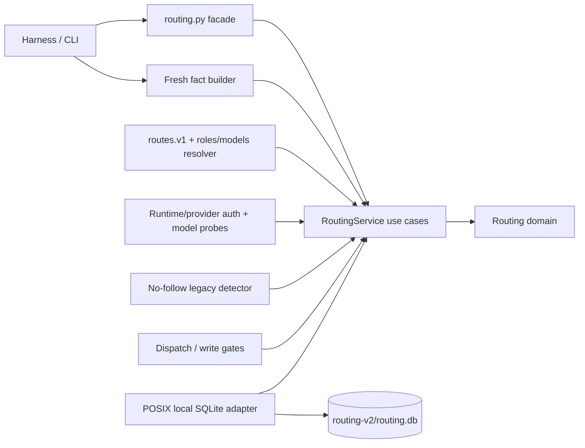
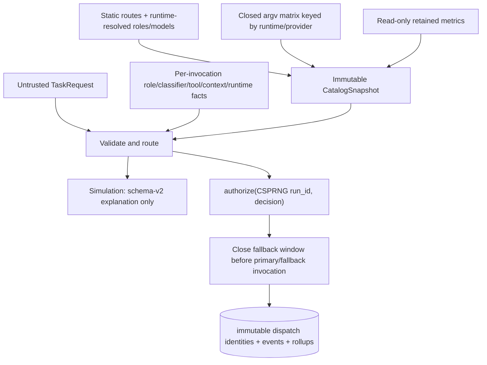
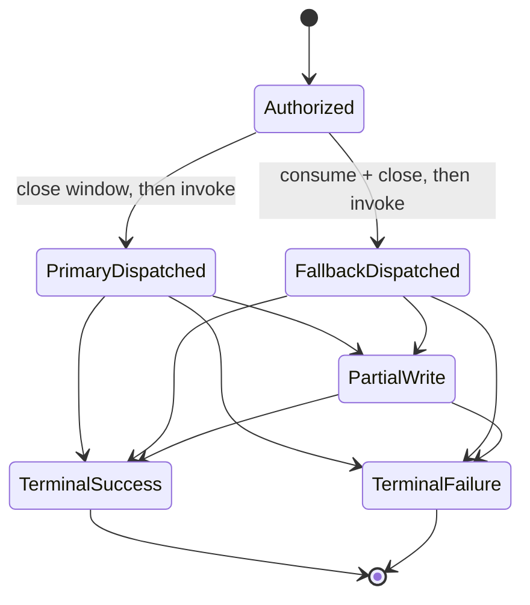

# Architecture overview

This is the current high-level map for trusted routing P1R. It describes the accepted architecture target, not
evidence that implementation is complete; decision rationale lives in the [ADR index](../adr/README.md).

## Component map

Policy and immutable values live in the domain; dependencies point inward. Caller intent cannot supply observed
facts, catalog, auth, IDs, or paths. Production persistence is fixed-root POSIX/local only; simulation is composed
without the SQLite mutation or dispatch capability.

## Data flow

Each static ID binds exactly the catalog tuple without runtime; a runtime-only change preserves `route_id`.
`CatalogSnapshot` separately binds that ID to immutable
`(route_id,runtime,provider,model,family,effort)` compatibility, and any authorization mismatch fails closed. A
truncated-ID collision invalidates the snapshot.
Missing/conflicting `selected_runtime` or any other mandatory fact disables dispatch. Auth cannot cross runtime
boundaries: only the four approved P1R mappings are executable; Pi is simulation-only with execution disabled
until P2. Explain leaves existing state byte-identical and creates no state.

## Key workflows

A pre-dispatch restart may consume fallback only if the durable row is still
authorized/open/non-partial/non-terminal; after `mark_dispatched`, external start, or failed terminal commit it
never may. Reviewer/auditor/judge routing uses the actual provider/model/family/effort/runtime of a
terminal-success `code-rw` dispatch, excludes its family, and prefers another authenticated provider.

## Use cases and delivery boundary

- Explain a trusted hypothetical route without mutation.
- Authorize exactly one writer and at most one pre-write fallback.
- Route independent review from persisted writer identity.
- Report exact retained all-route/per-route p50/p90 plus insertion-counted lifetime rollups without task identity.
- Refuse persistent routing on unsafe paths, unsupported platforms, or unreliable/unknown network filesystems.
- Enumerate only the approved legacy basenames/rotated-event regex, `lstat` without following, and warn
  present/unsafe without opening, reading, or mutating legacy state.

P1R is the only active implementation boundary. P2 and P3 remain paused until P1R passes its package gates and
independent acceptance.
