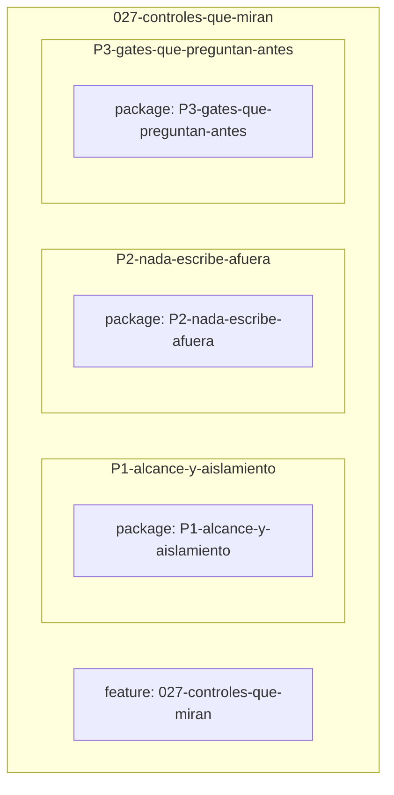

# 027-controles-que-miran · grafo

<!-- notas:auto -->

```mermaid
flowchart TD
subgraph sg_027_controles_que_miran["027-controles-que-miran"]
  feature_027_controles_que_miran_1["feature: 027-controles-que-miran"]
  subgraph sg_027_controles_que_miran_p1_alcance_y_aislamiento["P1-alcance-y-aislamiento"]
    package_027_controles_que_miran_p1_alcance_y_aislamiento_1["package: P1-alcance-y-aislamiento"]
  end
  subgraph sg_027_controles_que_miran_p2_nada_escribe_afuera["P2-nada-escribe-afuera"]
    package_027_controles_que_miran_p2_nada_escribe_afuera_1["package: P2-nada-escribe-afuera"]
  end
  subgraph sg_027_controles_que_miran_p3_gates_que_preguntan_antes["P3-gates-que-preguntan-antes"]
    package_027_controles_que_miran_p3_gates_que_preguntan_antes_1["package: P3-gates-que-preguntan-antes"]
  end
end
```
<!-- /notas:auto -->

## Notas propias

_Lo que escribas fuera del bloque auto se preserva en cada regeneración._
