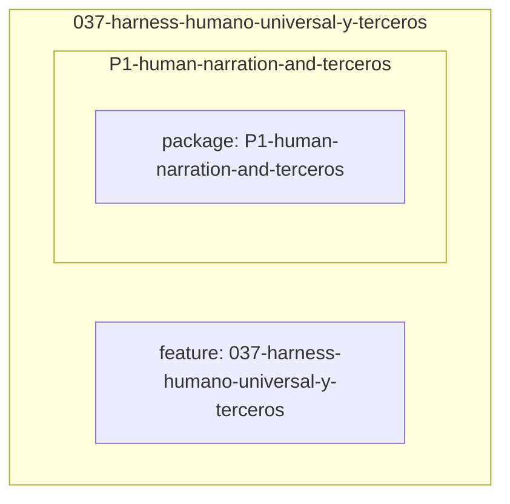

# 037-harness-humano-universal-y-terceros · grafo

<!-- notas:auto -->

```mermaid
flowchart TD
subgraph sg_037_harness_humano_universal_y_terceros["037-harness-humano-universal-y-terceros"]
  feature_037_harness_humano_universal_y_terceros_1["feature: 037-harness-humano-universal-y-terceros"]
  subgraph sg_037_harness_humano_universal_y_terceros_p1_human_narration_and_terceros["P1-human-narration-and-terceros"]
    package_037_harness_humano_universal_y_terceros_p1_human_narration_and_terceros_1["package: P1-human-narration-and-terceros"]
  end
end
```
<!-- /notas:auto -->

## Notas propias

_Lo que escribas fuera del bloque auto se preserva en cada regeneración._
