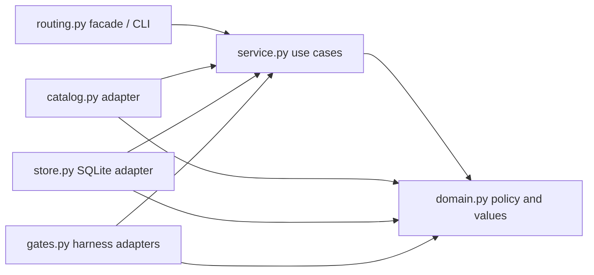

# P1R trusted routing-v2 design

## Status and baseline

This design implements the architecture review for Feature Contract
`003-trusted-routing-pi-runtime` version `2.0.0`. It does not approve the draft contract or constitute
implementation evidence.

No solution baseline fits: this is a local harness routing runtime, not a management dashboard, data/ML
pipeline, B2B integration API, or e-commerce surface. The established Python CLI and repository conventions
therefore win; the baseline contributes only the preference for a small synchronous core, one durable store,
and explicit risk boundaries.

Confirmed constraints from the existing system:

- `ai/scripts/set_agents_app.py` already owns `ROOT`, `STATE_DIR`, CLI envelopes, and the composition point.
- Pi stays opt-in, the Sol/medium parent invariant stays in force, and the existing roles and runtimes remain
  authoritative.
- No remote service, deployment topology, gateway, or asynchronous worker is part of P1R.

The repository already proves that `roles.tsv` carries `role`, `capability`, and `duty`, and that
`models_config.load_roles(...)` resolves the exact OpenCode, Claude Code, and Codex model for each canonical
role from `models.toml`. The current router does not yet have the complete fact builder, fresh authentication
probes, context-manifest adapter, audited route catalog, or routing-v2 dispatch record. Those integrations remain
**UNVERIFIED** and are dispatch blockers until the review gates at the end of this design pass against real code
and production-shaped samples.

## Boundaries and dependency direction

`ai/scripts/routing.py` remains a thin compatibility facade and composition root. New behavior is organized by
the routing domain:

```text
ai/scripts/routing.py
        │ composes
        ▼
ai/scripts/routing_core/
  ├── domain.py   immutable values, invariants, state transition rules
  ├── service.py  route/authorize/lifecycle use cases and inward-owned ports
  ├── catalog.py  repository catalog, resolved-model inventory, and auth-probe adapters
  ├── store.py    fixed-root SQLite adapter
  ├── gates.py    harness fact-builder and dispatch gate adapters
  └── __init__.py narrow supported exports
```

Dependencies point inward:



- `domain.py` has no filesystem, environment, CLI, SQLite, provider SDK, or framework imports.
- `service.py` owns small ports for snapshot construction, observed facts, read-only metrics, mutation,
  cryptographic randomness, hashing, and time. It contains orchestration, while eligibility, ranking, route
  identity, role classification, and lifecycle invariants remain pure domain rules.
- `catalog.py`, `store.py`, and `gates.py` implement those ports. They map outer data into domain values and
  contain no ranking or authorization policy.
- `routing.py` constructs the production adapters and exposes the stable entry point; it does not accept alternate
  store or catalog paths. Test composition may explicitly inject roots, time, subprocess, randomness, and hash
  adapters without exposing those seams through production CLI, environment, or routing APIs. `__init__.py`
  exports only types deliberately supported by the package.

This preserves SRP and dependency inversion without introducing a general plugin framework. A second
implementation of a port is not required for P1R; test doubles may satisfy the same narrow protocol.

## Trust model and key types

### Inputs

- `TaskRequest` is untrusted caller intent. It may express the requested operation or task class, but it can
  never assert authoritative role, risk, critical surface, write state, tool availability, provider
  authentication, quota, model availability, catalog contents, route ID, run ID, or writer identity.
- `ObservedTaskFacts` is a complete immutable harness-built value for exactly one route invocation. Its source
  matrix is frozen below; no field may be sourced from `TaskRequest`.
- `CatalogSnapshot` is immutable and is built internally from the audited repository catalog, canonical
  `roles.tsv`, runtime-resolved `models.toml`, fresh authentication observations, and stored metrics. The caller
  cannot construct, replace, or partially override it.
- `ImplementationIdentity` is created only by resolving `review_of_run_id` to a completed persisted writer
  dispatch. “Completed writer” means a `code-rw` role with a durably committed terminal success and the actual
  dispatched route's provider, model, family, effort, and runtime. Caller-supplied provider, model, family,
  effort, runtime, or role claims are ignored and cannot repair an invalid reference.

The `ObservedTaskFacts` source and conflict matrix is:

| Immutable fact field | Sole authoritative harness source | Caller treatment |
|---|---|---|
| `canonical_role` | dispatch target selected by the harness, validated against canonical `roles.tsv` | a caller role never replaces it |
| `operation`, `task_class` | harness classifier | caller values may only add a more conservative constraint |
| `read_write_mode`, `write_started` | current harness tool-capability and dispatch state | `read`/not-started claims never erase observed write capability or a started write |
| `risk`, `criticality`, `affected_surfaces` | harness classifier | caller risk/surfaces are set-unioned or raised, never removed/lowered |
| `required_tools` | capability/tool policy for the selected harness action | caller tools are additive; omission removes nothing |
| `context_required`, `context_present`, `critical_context_coverage` | context-pack manifest and its critical-coverage result | caller context text never proves presence or coverage |
| `selected_runtime` | runtime already selected by harness dispatch composition | missing/unknown/conflicting runtime is incomplete; caller runtime cannot replace it |
| `facts_version`, `observed_at` | fact builder for this single invocation, using the injected UTC clock | absent, unsupported, future, reused, or stale observations are incomplete |

All fields are mandatory. The fact builder compares caller intent only after the observed value exists. Missing,
stale, ambiguous, or internally conflicting observations return a non-dispatchable decision with
`execution_enabled=false` and `FACTS_INCOMPLETE`; a conflict adds an allowlisted conflict reason. The router never
turns that result into a lower lane, lower tier, alternate runtime, or non-frontier execution path.

Freshness is an invocation scope, not a reusable TTL cache: the facade opens one in-memory observation scope,
captures `observed_at`, builds exactly one facts value with the supported `facts_version`, passes it directly to
`route`, and invalidates the scope when that call returns. The internal constructor/scope capability is neither
serializable nor caller-accessible; a facts value issued by another, closed, or already-consumed scope is stale.
The injected clock makes future/skew and one-invocation behavior deterministic in tests.

`RoutingService.route(request, facts, review_of_run_id=None)` is the public use-case contract. Dispatch-capable
routing requires a complete `ObservedTaskFacts`. The service builds its own `CatalogSnapshot` through its
catalog port; a snapshot is not a public argument.

Role class is derived only from the canonical roster row:

- writer: `capability=code-rw`;
- audit reviewer/auditor: `capability=review-ro` and `duty=audit`;
- judge: `capability=review-ro` and `duty=judge`.

No role name substring or caller label classifies a role. For audit reviewers and judges,
`review_of_run_id` is mandatory. The resolved record must be the completed writer described above. The writer
family is removed before ranking; among the remaining authenticated candidates, a provider different from the
writer provider ranks first. An empty independent set fails closed.

Route selection does not mint or accept a run identifier. Immediately before authorization, the harness creates
`run1_<32hex>` with 16 bytes from the operating-system CSPRNG. `authorize(run_id, decision)` is a separate use
case; its `run_id` must match that exact shape, is never caller/task-derived, and is never copied into `events`.

### Simulation boundary

`--route-explain` invokes the same pure validation, snapshot construction, eligibility, identity, and ranking
logic, but its composition type has no mutation port, lifecycle capability, dispatch callback, or fallback
callback. It may query an already-existing read-only metrics view and `lstat` the recognized legacy names, but
cannot initialize SQLite or create any file. A simulated decision is informational and can never be exchanged for
authorization; real dispatch must recompute and durably authorize the route. Verification hashes every
pre-existing routing-v2 database/artifact before and after explain and proves byte identity; with no prior state,
the command must leave no routing-v2 file or directory behind.

## Repository route catalog

`ai/catalogs/routes.v1.toml` is audited, repository-owned configuration. The loader uses this exact path under
the resolved repository root; neither a request nor an environment value may choose another catalog.

The version-1 format is:

```toml
catalog_version = 1

[[routes]]
provider = "openai-codex"
model = "gpt-5.6-sol"
family = "gpt-5.6"
effort = "medium"
tiers = ["balanced", "frontier"]
roles = ["architect"]
tools = ["read", "write", "shell"]
curated_priority = 10
```

Every `[[routes]]` row contains exactly the eight static fields shown. Runtime is deliberately not part of that
row or its static route ID. Authentication, enablement, runtime compatibility, quota, health, latency, outcomes,
and route IDs are forbidden in the TOML because they are observed or derived. Validation rejects an unsupported
catalog version; missing, duplicate, or unknown keys; empty identifiers or sets; invalid effort/tier/tool values;
roles absent from canonical `roles.tsv`; provider/model/family values absent from the resolved inventory; and
duplicate canonical route content. Arrays are treated as sets and normalized only after duplicates are rejected.
One invalid row invalidates the complete snapshot rather than being silently dropped.

### Inventory adapters

Snapshot construction is fresh and internal for each route invocation:

1. `models.toml [routing].enabled_providers` supplies the complete enabled-provider set. Subscription flags are
   not authentication evidence.
2. `models_config.load_roles(active_profile, roles.tsv, models.toml)` supplies the exact canonical role and model
   resolved for `opencode`, `claude-code`, or `codex`; the Pi mapping also requires the exact
   `[orchestrator.pi]` parent. `CatalogSnapshot` intersects those assignments with each static catalog row and
   creates the authoritative immutable compatibility set
   `(route_id, runtime, provider, model, family, effort)`. Neither source can add a model or runtime mapping by
   itself, and a route/runtime pair absent from this set is ineligible.
3. A bounded redacted subprocess adapter observes authentication and model visibility for the exact
   `(runtime, provider)` compatibility mapping, using only the fixed argv matrix below. It retains runtime,
   provider, available boolean, an allowlisted status/exit class, and numeric return code when a process exits.
   It never reads a credential/session/OAuth/token file and never persists raw stdout or stderr.
4. Stored metrics may rank an otherwise eligible static row but never create inventory, authenticate a provider,
   or alter the static row.

The P1R auth matrix is closed:

| `(runtime, provider)` | Fixed subprocess argv and required mapping |
|---|---|
| `(codex, openai-codex)` | `codex login status` |
| `(claude-code, anthropic)` | `claude auth status --json` |
| `(opencode, openai-codex)` | `opencode auth list --pure`, requiring the exact OpenCode provider key `openai`; then `opencode models openai --pure`, requiring the row's exact model |
| `(opencode, anthropic)` | `opencode auth list --pure`, requiring the exact OpenCode provider key `anthropic`; then `opencode models anthropic --pure`, requiring the row's exact model |

Each argv is executed without a shell, once per invocation, under a fixed timeout and redaction adapter. Missing
executable, timeout, nonzero exit, missing provider/model, unrecognized/contradictory output, or any ambiguity
makes only that exact pair unavailable. No auth observation may be borrowed across runtimes, even when provider
or model strings match.

All other `(runtime, provider)` pairs are unavailable in P1R. Pi may be evaluated only by the non-mutating
simulation path: its Sol/medium parent alias and catalog/model compatibility may be explained, but
`execution_enabled=false` until P2 supplies and approves a Pi-specific auth/runtime adapter. A Claude-only
observation can therefore keep an eligible `(claude-code, anthropic)` child while Pi remains disabled.

Each route ID is:

```text
rt1_ + first_16_lowercase_hex(
  SHA256(canonical_tuple)
)
```

The canonical tuple contains, in this exact order:

1. `catalog_version`;
2. `provider`;
3. `model`;
4. `family`;
5. `effort`;
6. sorted `tiers` by their UTF-8 byte representation;
7. sorted `roles` by their UTF-8 byte representation;
8. sorted `tools` by their UTF-8 byte representation;
9. `curated_priority` as a base-10 integer.

Serialization is a versioned, UTF-8, length-prefixed sequence, including list lengths, so field boundaries and
empty values cannot collide. The ID binds exactly this immutable static row. Runtime, authentication, enablement,
quota, availability, health, metrics, observed facts, context coverage, caller data, ranking, and
selected/fallback position are excluded from static identity; changing only runtime does not change `route_id`.
Before dispatch, every selected or fallback ID is recomputed from its immutable row in the same snapshot and
compared in constant time, then its complete `(route_id, runtime, provider, model, family, effort)` authorization
identity is required to exist in the snapshot's immutable compatibility set. Any runtime mismatch fails closed.

Production hashing is SHA-256. Snapshot construction first canonicalizes all rows, rejects duplicate tuples,
computes every truncated ID, and then groups by ID. If one `rt1_<16hex>` contains two distinct canonical tuples,
the entire snapshot is invalid and no row may route or authorize. The hash function is an injected narrow port so
tests can deterministically force a truncation collision; production composition exposes only SHA-256.

## Eligibility and ranking

Validation and eligibility are fail-closed and deterministic:

1. Verify platform/filesystem and storage safety when persistent state is required, request shape, complete fresh
   facts, catalog integrity including collision detection, resolved inventory/fresh auth observations, and review
   identity.
2. Apply observed facts over conflicting request intent. Any uncertain downgrade becomes invalid/critical, not
   permissive; no incomplete/conflicting frontier decision is downgraded to another lane.
3. Remove disabled, unauthenticated, unavailable, quota-exhausted, unknown, role-incompatible,
   selected-runtime/model-incompatible, tool/context-incompatible, unsupported runtime/provider-pair, and
   Pi-execution candidates. A complete Pi candidate may remain explainable only with `execution_enabled=false`.
4. For review roles, exclude the persisted writer family before any preference.
5. Rank independent provider, catalog tier/effort fit, stored metrics, curated priority, then static route ID as
   the final stable tie-break.

Metrics can change which eligible immutable row is selected, but never any row's static identity or make an
ineligible row eligible. Reason output uses only the stable redacted families defined below.

## Fixed state root and storage safety

Persistent routing-v2 is supported only on POSIX hosts with Python `sqlite3`, reliable local filesystem locking,
and Unix ownership/mode semantics. Windows, WSL paths mounted from Windows, NFS/SMB/CIFS/FUSE mounts without a
positive reliable-local-locking classification, and unknown filesystem types return `ROUTING_UNAVAILABLE` before
creation or connection. The injected `FilesystemSupportProbe` is platform-specific; tests cover every supported
classification and fail closed for unknown values. This does not change non-routing behavior on those platforms.

The only production routing-v2 root is the harness-managed state base plus `routing-v2`, resolving to
`~/.local/state/set-agentes/routing-v2`. Production routing composition computes that base itself and deliberately
ignores `SET_AGENTS_STATE`; the current environment override remains only for unrelated legacy behavior until
retired. Tests relocate routing-v2 through an explicit composition dependency, never through production
environment lookup, a request, or a public routing API. The same injected test composition supplies the legacy
base described below.

Before creation or open, the storage adapter:

1. walks each existing ancestor and managed component with `lstat` and descriptor-relative `openat`/`dir_fd`
   operations, never following a link;
2. rejects an ancestor writable by identities other than root or the effective UID, and requires the managed
   routing-v2 directory to be an effective-UID-owned real directory with mode exactly `0700`;
3. creates missing managed components with a private umask and descriptor-relative operations;
4. requires `routing.db`, `routing.db-wal`, and `routing.db-shm`, whenever present, to be effective-UID-owned
   regular non-link files with mode exactly `0600`; and
5. records `(st_dev, st_ino, file type, owner, mode)` for the root and database, opens SQLite, validates/creates
   WAL/SHM, then revalidates root, DB, WAL, and SHM identities and modes before use and after connection setup.

Detected replacement, unsafe ownership/mode/type, symlink, corrupt database, failed integrity check, unsupported
schema, unsupported platform/filesystem, or required-locking/pragma failure is fail-closed. The adapter never
deletes, repairs, replaces, chmod-fixes, or automatically recreates unsafe/corrupt existing state.

Python `sqlite3` opens by pathname rather than an already-verified file descriptor. Component `lstat`/`dir_fd`
checks plus before/after identity comparison prevent pre-existing links and detect replacement, but cannot
mathematically prevent a process running as the same UID from intentionally racing that pathname during the
SQLite open. A malicious same-UID process is outside this feature's threat model because it can already read or
replace all user-owned harness state. Accidental replacement and attackers without that UID remain in scope; any
detected race or identity change fails closed.

### Threat model clarification (R3 amendment, 2026-07-24)

The same-UID exclusion above extends to any code executing inside the harness process. "Caller" throughout this
design means untrusted *intent* (a `TaskRequest` and its claims), not untrusted in-process code: Python offers no
private constructors or in-process isolation (`object.__new__`, `dataclasses.replace`, patchable `sys.modules`),
and any same-UID code can already write the 0600 database directly with `sqlite3.connect`. Requirements of the
class "the caller cannot construct/replace internal composition objects" are therefore satisfied by *sealed
production composition* (snapshot/inventory built internally by the service, private test-only seams, bindings
recomputed from the on-disk catalog at authorization time), not by unforgeability against in-process adversaries,
which is unattainable and out of scope. Consequently the following are recorded as approved exceptions rather
than defects: in-process non-forgeable permits (FD-001 residual), positive filesystem classification via
`statfs`/mountinfo and full descriptor-relative traversal (FD-004 residual — `sqlite3` opens by pathname, so these
add detection only for an excluded adversary), and per-authorization re-probing of runtime inventory (FD-006
residual). See `docs/notas/decisiones/` entry `r3-threat-model-amendment`.

SQLite is configured on every connection with:

```text
PRAGMA journal_mode=WAL
PRAGMA synchronous=FULL
PRAGMA foreign_keys=ON
PRAGMA busy_timeout=0
```

An unexpected `schema_version`, failed integrity check, unreadable header, or unavailable required pragma fails
closed. The opening probe matrix covers root/ancestor/DB/WAL/SHM symlinks and replacements, ownership/modes,
corruption, schema mismatch, unsupported filesystem/platform, and lock failure. Mutation conflicts are returned
immediately and are never automatically retried.

## Schema

All timestamps are UTC integer milliseconds. Booleans are constrained integers. Status, outcome, event type,
reason family, role, runtime, provider, model, family, effort, and route ID values are validated against domain
allowlists before binding.

### `meta`

```text
key TEXT PRIMARY KEY
value TEXT NOT NULL
```

Required keys are `schema_version` and `installation_hmac_salt`. The salt is generated once from the operating
system CSPRNG, stored only in the private database, never accepted from a caller, and never emitted. It is reserved
for keyed privacy identities and schema compatibility even though current events omit task/run identity. The
legacy `routing.salt` is neither read nor migrated. Schema creation and both meta inserts are one exclusive
initialization transaction.

### `dispatches`

```text
run_id TEXT PRIMARY KEY
role TEXT NOT NULL
role_class TEXT NOT NULL
selected_route_id TEXT NOT NULL
selected_runtime TEXT NOT NULL
selected_provider TEXT NOT NULL
selected_model TEXT NOT NULL
selected_family TEXT NOT NULL
selected_effort TEXT NOT NULL
fallback_route_id TEXT NULL
fallback_runtime TEXT NULL
fallback_provider TEXT NULL
fallback_model TEXT NULL
fallback_family TEXT NULL
fallback_effort TEXT NULL
actual_route_id TEXT NULL
actual_runtime TEXT NULL
actual_provider TEXT NULL
actual_model TEXT NULL
actual_family TEXT NULL
actual_effort TEXT NULL
state TEXT NOT NULL
partial_write INTEGER NOT NULL DEFAULT 0
fallback_window_open INTEGER NOT NULL
fallback_consumed INTEGER NOT NULL DEFAULT 0
authorized_at INTEGER NOT NULL
dispatched_at INTEGER NULL
partial_write_at INTEGER NULL
fallback_consumed_at INTEGER NULL
terminal_at INTEGER NULL
updated_at INTEGER NOT NULL
```

The selected `(route_id,runtime,provider,model,family,effort)` identity is immutable after insertion. Fallback
identity is either all null or the same complete immutable tuple. Actual identity is all null while merely
authorized, becomes the complete selected tuple on primary `mark_dispatched`, or the complete fallback tuple on
fallback consumption, and is immutable thereafter. A completed writer used for review identity is specifically
`role_class=writer`, `state=terminal_success`, and a complete actual identity including `actual_effort`.

Check constraints and immutable-identity update guards enforce the `run1_<32hex>` primary key shape, known role
classes/states/runtimes/efforts, selected non-null and fallback/actual tuple all-or-none rules, monotonic timestamp
presence, sticky
`partial_write`/`fallback_consumed`, `fallback_window_open` transitions from `1` to `0` only, a fallback tuple
before consumption, and one terminal outcome. `authorize` always inserts `fallback_window_open=1`; absence of a
fallback tuple still prevents consumption. `run_id` is required for lifecycle identity but is never copied into
`events`.

Useful index: `dispatches(role, state, terminal_at)`. The primary key is the single-writer uniqueness boundary;
no dispatch row is removed by event retention.

### `events`

```text
event_id INTEGER PRIMARY KEY
occurred_at INTEGER NOT NULL
event_type TEXT NOT NULL
route_id TEXT NULL
runtime TEXT NULL
provider TEXT NULL
model TEXT NULL
family TEXT NULL
outcome TEXT NOT NULL
reason_family TEXT NOT NULL
latency_ms INTEGER NULL
latency_bucket TEXT NOT NULL
```

The table contains only allowlisted operational values. It has no task body, prompt, source, contextual path,
run ID, user identity, provider output, credential, OAuth/token data, secret, PII, exception string, or traceback.
`latency_ms` is a bounded non-negative operational integer; `latency_bucket` is derived from fixed versioned
boundaries for lifetime histograms.

Useful indices are `events(occurred_at, event_id)` for retention/percentiles and
`events(route_id, occurred_at, event_id)` for per-route reporting.

### `metric_rollups`

```text
route_key TEXT NOT NULL
runtime TEXT NOT NULL
provider TEXT NOT NULL
model TEXT NOT NULL
family TEXT NOT NULL
outcome TEXT NOT NULL
reason_family TEXT NOT NULL
latency_bucket TEXT NOT NULL
lifetime_count INTEGER NOT NULL
lifetime_latency_sum_ms INTEGER NOT NULL
compacted_count INTEGER NOT NULL
exclusion_count INTEGER NOT NULL
fallback_offered_count INTEGER NOT NULL
fallback_consumed_count INTEGER NOT NULL
fallback_success_count INTEGER NOT NULL
fallback_failure_count INTEGER NOT NULL
PRIMARY KEY (
  route_key, runtime, provider, model, family, outcome, reason_family, latency_bucket
)
```

`route_key` is the static route ID or the allowlisted sentinel `none`; all other absent dimensions use the same
explicit sentinel rather than raw/free text. Counters are non-negative. Every event insertion updates all
applicable lifetime deltas exactly once in the same transaction: `lifetime_count`,
`lifetime_latency_sum_ms`, the selected latency bucket, exclusion count, fallback offered/consumed count, and
fallback success/failure count. One excluded candidate is one allowlisted exclusion event, so it has one
unambiguous rollup key.

Compaction groups the exact deletion set by the complete rollup key and increments only `compacted_count` by the
number of deleted rows. It never touches lifetime, latency-sum, histogram, exclusion, or fallback counters,
because those were already counted at insertion. Thus lifetime totals come solely from insertion-time rollups,
while retained-event percentiles come from `events`.

## Transaction and state-machine contract

Every lifecycle mutation uses one connection, `BEGIN IMMEDIATE`, precondition checks, mutation, matching
event/rollup write, and commit. Any failure rolls back the entire unit. `SQLITE_BUSY`, zero affected rows, an
unknown prior state, or an invalid transition returns `STATE_CONFLICT`; no caller loop or adapter retry follows.

- **Authorize:** accept only a harness-CSPRNG run ID and a decision produced by `route`; recompute selected and
  optional fallback bindings, ensure no `run_id` exists, insert the complete immutable identities with
  `state=authorized`, `actual_* = NULL`, `partial_write=0`, `fallback_consumed=0`, and
  `fallback_window_open=1`, and record insertion-time event/rollup evidence before returning.
- **Mark primary dispatched:** require `state=authorized`, `fallback_window_open=1`, `partial_write=0`, and no
  terminal outcome. In one commit set `state=dispatched`, `fallback_window_open=0`, the actual identity to the
  selected tuple, and `dispatched_at`. This commit happens **before any external primary invocation**. Once it
  commits, no fallback can ever be consumed, even if the process crashes before the external command starts.
- **Mark partial write:** require `state=dispatched`; before the dispatcher permits the first writer mutation,
  atomically set sticky `partial_write=1` and its timestamp. It can never be cleared. A provider/runtime that can
  bypass this gate is ineligible for writer dispatch.
- **Consume fallback once:** require `state=authorized`, `fallback_window_open=1`, a complete pre-authorized
  fallback tuple, `partial_write=0`, `fallback_consumed=0`, and no terminal outcome. In one commit set
  `state=dispatched`, `fallback_window_open=0`, `fallback_consumed=1`, actual identity to the fallback tuple, and
  both consumed/dispatched timestamps. This commit happens **before any external fallback invocation**.
- **Terminal outcome:** only a non-terminal active dispatch may set one terminal success/failure state and
  timestamp. A failed terminal persistence attempt is an unsafe checkpoint: it never triggers redispatch or
  fallback.

Authorization persistence, partial-write persistence, fallback consumption, and terminal persistence are
preconditions for the corresponding external action or acknowledgement. Unknown or corrupt state has no recovery
transition and fails closed.

The crash/restart matrix is deliberately availability-conservative:

| Last durable point | External action permitted before crash | Restart behavior |
|---|---|---|
| before authorization commit | none | no dispatch exists; caller may start a new authorization transaction |
| `authorized`, window open | none | even after restart, primary may be marked dispatched or the one fallback may be consumed only if the durable row is still authorized/open/non-partial/non-terminal |
| primary `mark_dispatched` commit | primary may have started, even if no output was observed | window is closed; no primary retry, redispatch, or fallback |
| before fallback-consume commit | none from fallback | transaction rolled back; fallback remains eligible only if the durable row is still authorized/open |
| fallback-consume commit | fallback may have started | window is closed and consumed; no retry or second fallback |
| sticky partial-write commit | selected actual route may mutate | no retry/fallback; only terminal/checkpoint handling |
| terminal success/failure commit | completed external attempt | terminal; no transition back and no fallback |
| terminal commit fails after an attempt | attempt may have completed, durable row remains dispatched/open=0 | unsafe checkpoint; no retry/fallback because completion is ambiguous |

Restart does not itself consume or close fallback: the durable row is the sole authority. A pre-dispatch restart
may consume fallback only when the row still satisfies `state=authorized`, `fallback_window_open=1`,
`partial_write=0`, no terminal outcome, and unused complete fallback identity. After `mark_dispatched` commits,
after any external invocation could have started, or after a terminal commit fails and leaves the durable
dispatched/open=0 checkpoint, fallback and redispatch are permanently denied. No external primary or fallback
invocation is allowed before its respective closing transaction commits.

## Retention and reporting

After an event mutation, retention is required when retained count exceeds 10,000 or the oldest event is older
than 90 days. One `BEGIN IMMEDIATE` transaction captures one UTC `now` and derives one
`cutoff = now - 90 days`:

1. materialize the exact deletion IDs: first every event with `occurred_at < cutoff` (an event exactly at the
   cutoff is retained), then the oldest remaining rows above the newest 10,000, ordered deterministically by
   `(occurred_at, event_id)`;
2. group only those IDs by the complete rollup key;
3. increment only `compacted_count` by each group's deleted-row count; and
4. delete exactly those event IDs before commit.

A crash exposes either the pre-compaction or post-compaction database, never a half-merged set. Dispatches are
never compacted.

Reports compute exact nearest-rank p50 and p90 over non-null retained `latency_ms` for (a) all retained events and
(b) each static route independently, using an ordered SQLite query and zero-based offset
`ceil(p * count) - 1`. An empty population returns `null` for both percentiles. No in-memory approximation or
histogram percentile is reported as exact. Lifetime event, outcome, exclusion, fallback, count, and latency totals
come from insertion-time `metric_rollups`. Lifetime percentiles are not claimed because compacted raw latency
samples no longer exist.

## Stable failures and CLI mapping

Errors are domain failures mapped once at the facade. Output is a versioned redacted envelope with no exception
message or traceback. With `--json`, stdout contains exactly one JSON document with exactly these top-level
fields:

```json
{
  "schema_version": 2,
  "ok": true,
  "command": "route-explain",
  "data": {},
  "warnings": [],
  "reason_codes": []
}
```

`schema_version` is integer `2`; `ok` is boolean; `command` is the canonical invoked command; `data` is always an
object; and both arrays contain unique values from closed allowlists in stable order. Warnings may accompany exit
`0`. Human-mode redacted diagnostics go only to stderr; JSON mode writes no prose or diagnostic line around the
single document. Invalid or conflicting CLI arguments are exit `2`, not a best-effort command.

| Reason family | Exit |
|---|---:|
| `ROUTING_INPUT_INVALID` | 2 |
| `ROUTING_UNAVAILABLE` | 1 |
| `FACTS_INCOMPLETE` | 1 |
| `NO_ELIGIBLE_ROUTE` | 1 |
| `REVIEW_IDENTITY_INVALID` | 1 |
| `STORAGE_UNSAFE` | 1 |
| `STORAGE_CORRUPT` | 1 |
| `SCHEMA_MISMATCH` | 1 |
| `STATE_CONFLICT` | 1 |

The complete legacy universe under `STATE_DIR/routing` is:

```text
routing-decisions.json
routing-decisions.lock
routing-events.jsonl
routing-metadata.json
routing.salt
routing.lock
^routing-events-[0-9]+-[0-9]+\.jsonl$
```

The detector enumerates directory entry names, selects only the six exact basenames or the strictly anchored
rotated-events regex, and calls descriptor-relative `lstat` on each match without following links. It never opens
or reads a matched entry. A safe regular-file presence adds `LEGACY_ROUTING_STATE_PRESENT`; a symlink or any other
unsafe type adds both `LEGACY_ROUTING_STATE_PRESENT` and `LEGACY_ROUTING_STATE_UNSAFE`. Detection never imports,
hashes through, repairs, chmods, deletes, renames, or dual-writes a legacy object. These warnings are not
authorization evidence and do not fail an otherwise valid simulation by themselves.

## Scale / Data / Security decisions

### Data

ADR-0005 chooses standard-library SQLite because routing authorization and lifecycle transitions require local
ACID transactions and single-writer exclusion. The model is relational, normalized, and strongly consistent;
document, key-value, graph, and vector stores do not match the access pattern. A vector store is not warranted
unless a separately approved feature requires measured semantic nearest-neighbor search over unstructured
content. An external relational service is not warranted unless routing must coordinate multiple hosts or local
SQLite lock/throughput measurements fail an approved service-level target. SQLite is available only through the
positive POSIX/local-filesystem support probe; an unsupported host is unavailable, never silently moved to a
weaker file protocol.

### Scale and topology

- No cache until profiling shows snapshot construction or read reporting exceeds its latency target for at least
  1,000 representative routes and a safe invalidation key is defined.
- No queue until a separately approved long-running task requires asynchronous backpressure/retries; dispatch
  authorization itself must remain synchronous.
- No CDN because there are no public static assets; reconsider only with a remotely deployed UI and geographically
  distributed latency requirements.
- No replica or shard until an external relational deployment exists and measured primary read saturation or
  single-database capacity is the demonstrated bottleneck.
- No load balancer or API Gateway while this remains one local CLI/runtime. A gateway becomes warranted only when
  multiple remotely exposed backend services or client types need centralized authentication, rate limiting,
  routing, and observability.
- No Vercel/PaaS, VPS/IaaS, or managed deployment is selected: P1R is installed local state, not a service.
  Deployment becomes a new ADR only after an approved multi-host/remote-control-plane requirement; the choice must
  then measure runtime duration, persistent-connection needs, ops capacity, and cost.

These are explicit YAGNI deferrals retained from ADR-0004; only its JSON/JSONL journal choice is superseded.

### Security

- **Least privilege:** routing reads only audited catalog/roster/inventory inputs and writes only the fixed private
  routing-v2 root. Auth adapters execute only the closed runtime/provider argv matrix (`codex login status`,
  `claude auth status --json`, and the paired OpenCode `auth list`/provider-specific `models` commands) with a
  bounded timeout and reduce results to allowlisted availability; provider credentials and raw output are never
  read from files, passed to the domain, or persisted.
- **Isolation:** repository configuration, observed inventory, pure policy, and persistence are separate
  boundaries. Caller intent cannot supply facts, snapshot, paths, route IDs, run IDs, review identity, or hash
  implementation or installation HMAC salt. Simulation composition has no mutation capability.
- **Session/token handling:** only authenticated/not-authenticated observations enter the snapshot. Raw sessions,
  OAuth artifacts, tokens, headers, and provider responses are prohibited from storage and output.
- **Recovery:** corruption, schema mismatch, unsafe permissions, and ambiguous lifecycle state fail closed and do
  not recreate the database. Recovery uses an operator-controlled, SQLite-consistent backup/restore of the whole
  private state followed by ownership, mode, schema, and integrity verification; a live DB/WAL file copy is not a
  valid backup. Recovery never infers or replays dispatch. Best-effort pathname-race detection is explicit; a
  malicious same-UID process is outside the threat model.

## Data-path and compatibility audit

A repository-wide production/test trace of `routing`, `route_task`, `routing_catalog`, `ExecutionState`,
`Telemetry`, `cli_envelope`, `route-explain`, and `routing-report` finds:

- `ai/scripts/set_agents_app.py` is the only production importer/composition consumer. Its `routing_catalog`
  currently constructs mutable rows and accepts an `observed_auth` test seam; `cmd_route_explain` constructs facts
  from caller-like values; `cmd_routing_report` opens the routing-v1 telemetry directory; and `_routing_output`
  consumes the schema-1 envelope.
- `ai/scripts/routing.py` contains all current writer/read/filter behavior for route fields, JSON decision state,
  fallback flags, telemetry JSONL/metadata/salt, percentiles, and schema-1 envelopes. These implementations are
  replaced behind the facade, not left as a second authority.
- `ai/scripts/models_config.py` is the canonical reader/resolver for `roles.tsv`, runtime model assignments,
  provider enablement, role capability, and duty. The new adapters consume it rather than duplicating parsing.
- `tests/test_routing.py` directly constructs the old route dictionaries and calls every old public helper; those
  tests must migrate to the facade/use-case contract and retain compatibility assertions. `tests/test_harness.py`
  consumes `SET_AGENTS_STATE` for broader app test isolation; routing-v2 tests must instead use explicit
  composition injection while non-routing tests remain unchanged.

No other production import, `WHERE`/filter, report, or exhaustive switch consumes the current routing fields or
legacy file names in this repository snapshot. The safe cut replaces all four production paths together,
removes the old JSON/JSONL path as an authority, and keeps schema-1 `models.toml`, the canonical roster, and the
three existing runtime behaviors unchanged.

## Implementer contract

The implementation must:

1. preserve `RoutingService.route(request, facts, review_of_run_id=None)` and keep `routing.py` thin;
2. create only the stated `routing_core` modules and keep dependencies inward;
3. accept no public catalog, auth map, route ID, run ID, review identity, hash implementation, or state-root
   authority;
4. implement the exact `ObservedTaskFacts` source matrix and fresh-invocation semantics; incomplete/conflicting
   facts must be non-dispatchable and may never downgrade;
5. construct inventory only from enabled providers, the exact closed `(runtime,provider)` auth/model command
   matrix, exact runtime-resolved role models, the audited catalog, and metrics; never borrow auth across runtimes,
   and keep Pi simulated/non-executable until P2 adds its adapter;
6. keep runtime out of the exact static-ID tuple; build the authoritative immutable
   `(route_id,runtime,provider,model,family,effort)` compatibility set inside `CatalogSnapshot`; reject every
   mismatch; and preserve immutable selected/fallback dispatch identities;
7. derive role classes only from roster capability/duty, generate opaque run IDs in the harness CSPRNG, and keep
   route selection separate from `authorize(run_id, decision)`;
8. persist selected/fallback/actual effort under the complete-tuple constraints and derive review identity only
   from a terminal-success writer's actual dispatched provider/model/family/effort/runtime, then enforce family
   exclusion and different-provider preference;
9. enforce the POSIX/local-filesystem support boundary, production root independent of `SET_AGENTS_STATE`,
   no-symlink/private-mode/identity revalidation, schema, pragmas, transactions, fallback-window closure, crash
   matrix, privacy, and error mapping above;
10. update all lifetime rollup counters exactly once at event insertion; make compaction update only
    `compacted_count`; and report exact retained all-route/per-route nearest-rank percentiles with null empties;
11. emit exactly the schema-2 envelope; enumerate only the six exact legacy basenames and strict rotated-events
    regex under `STATE_DIR/routing`; apply no-follow `lstat` without opening/reading/mutating matches; and emit the
    exact present/unsafe warnings;
12. keep explain composition physically incapable of mutation and prove byte-identical existing state/no newly
    created state, while preserving 28 roles, the three current runtimes, schema-1 compatibility, Pi opt-in, and
    Sol/medium parent behavior; Pi execution remains disabled throughout P1R.

The implementation must not add a remote service, gateway, queue, cache, deployment, caller/environment-selected
production routing root, automatic mutation retry, permissive recovery, raw auth/telemetry, or a new public data
contract.

## Review gates

Implementation cannot begin until these linchpin checks pass:

1. **Fact-source proof:** connect every mandatory matrix row to the real dispatch/classifier/tool/context/runtime
   source and prove missing, stale, ambiguous, caller-conflicting, and replayed observations fail closed.
2. **Catalog/inventory proof:** verify the audited TOML, canonical roster/resolver, enabled-provider set, all four
   supported runtime/provider command mappings and exact argv, provider/model absence and outage behavior, and
   metrics source. No credential-file probe or cross-runtime auth reuse is accepted.
3. **Pi identity proof:** verify both approved aliases and exact resolved model in simulation; prove Pi remains
   `execution_enabled=false` throughout P1R while a Claude-only snapshot can leave a Claude child eligible.
4. **Writer-identity proof:** demonstrate on a real routing-v2 persisted sample that roster-derived writer class,
   terminal success, actual selected/fallback provider/model/family/effort/runtime, and opaque run ID are
   trustworthy and that `review_of_run_id` cannot select a non-writer.
5. **Full consumer trace:** re-run the production/test trace above immediately before replacement and account for
   any consumer added after this design snapshot.

The completed package must then pass focused domain/catalog tests; exact static-ID golden vectors proving a
runtime-only change preserves `route_id`, plus an injected truncation collision and runtime-mismatch rejection;
each exact auth argv/mapping, unsupported pair, no-cross-runtime-borrow, OpenAI-only/Claude-only/outage/all-four-
runtime inventories; missing/forged/stale fact and
identity probes; CSPRNG run-ID shape/source probes; real SQLite concurrency with at most one winner; every row in
the explicit crash matrix; root/ancestor/DB/WAL/SHM identity, symlink, ownership, mode, corruption, schema,
unsupported-platform/filesystem, and locking probes; insertion/compaction counter conservation; 10,001-event and
90-day boundary tests with a single clock sample; exact retained all-route/per-route percentile/null checks;
privacy/redaction scans; exact schema-2 envelope assertions; byte-identical/no-state explain tests; legacy
exact-name/rotated-regex/no-follow/no-open/no-touch/warning checks; schema-1, 28-role, and existing-runtime
regression tests; lint/type/compile checks; and
the repository canonical full verification gate. An independent reviewer must confirm the package and P2/P3
remain paused.
